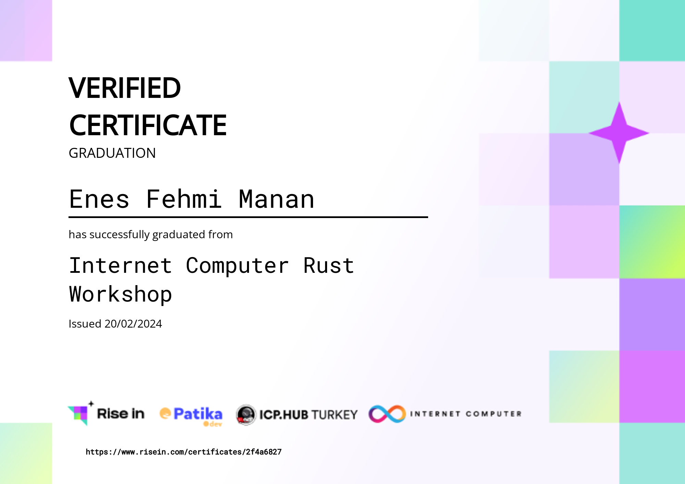

# Internet Computer Rust Workshop

This repo includes the projects developed at the Rust workshop held in cooperation with [Patika.dev](https://academy.patika.dev/tr/@enesmanan) and [ICP.Hub](https://www.risein.com/@enesmanan) Turkey.

## Projects

- **[Motoko To Do Project](https://github.com/enesmanan/icp-rust-workshop/tree/main/motoko_workshop)**
- **[Rust QR Code Project](https://github.com/enesmanan/icp-rust-workshop/tree/main/rust_workshop)** 

## Certificate

