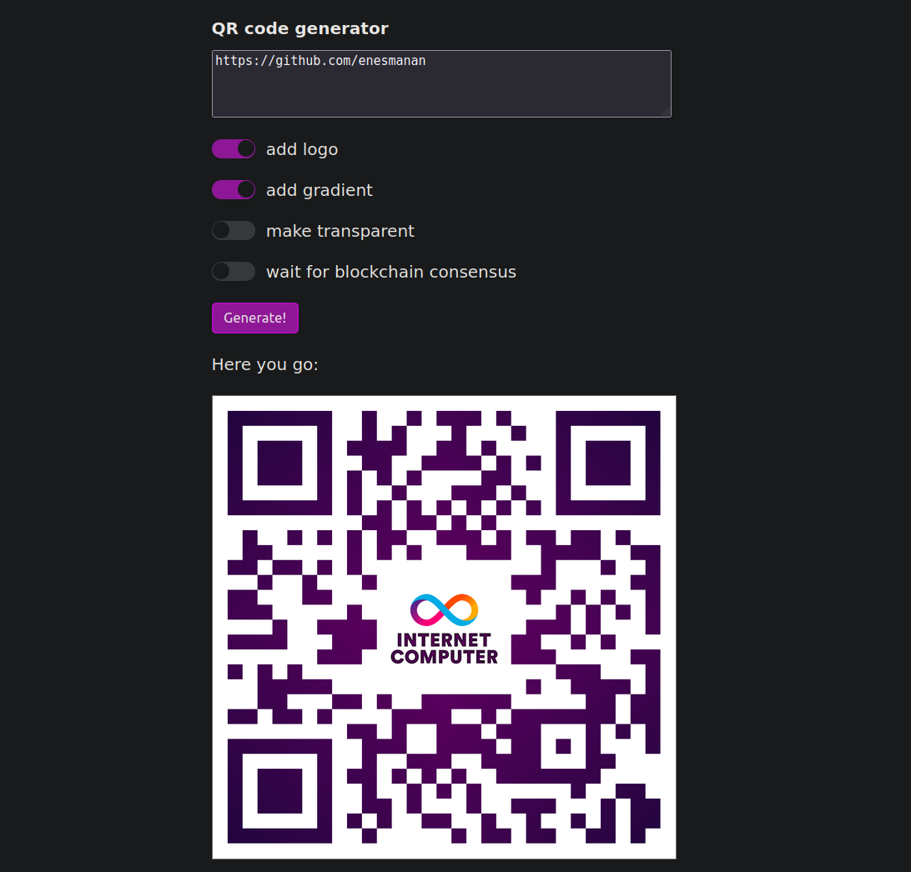

# QR Code Generator

QR Code Generator application with [Rust](https://www.rust-lang.org/).

## Requirements

### Environment

- Ensure that your dfx version is set to `0.16.1` (rust version `1.76.0` and node.js version `12.22.9`):

```bash
dfx --version
```

```bash
rustup target add wasm32-unknown-unknown
```

### Change Directory

```bash
cd rust_workshop
```

### install node_modules

```bash
npm install
```

### Run

```bash
dfx start --clean
```

- Launch deploy in another terminal:


```bash
dfx deploy
```

